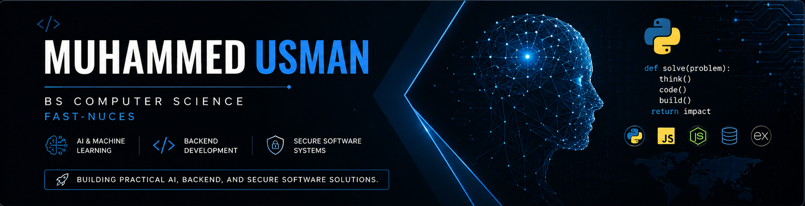

  

# Muhammed Usman

### BS Computer Science @ FAST-NUCES

**Computer Science Student • Python Developer • AI & Machine Learning Enthusiast**

Building practical AI, backend, and secure software projects.

 

---

## About Me

I'm a **Computer Science student at FAST-NUCES** passionate about **Artificial Intelligence, Machine Learning, Backend Development, and Secure Software Systems**.

I enjoy building practical software that solves real-world problems while continuously strengthening my skills in AI, backend development, and software engineering.

---

## Tech Stack

### Languages

  

### Backend & Databases

  

### Machine Learning

  

### Backend Frameworks

  

### Tools

---

## Featured Projects

### [Waste Management System](https://github.com/usman955/waste-management-system)

Full-stack waste reporting and recycling platform built with **Node.js, Express, EJS, and MySQL**.

---

### [EyeGuard-XAI](https://github.com/usman955/EyeGuard-XAI-FYP-)

Reliable and Explainable AI system for retinal disease screening.

---

### [Secure File Storage System](https://github.com/usman955/secure-file-storage-system)

Python-based secure file storage system implementing **AES-256 encryption**, **PBKDF2**, and **SQLite**.

---

### Parkinson's Disease Detection

Machine Learning model for Parkinson's disease detection using spiral drawing analysis.

---

###  Exam Scheduling System

Constraint Satisfaction Problem solver using graph coloring and heuristic optimization.

---

## Core Skills

- Artificial Intelligence
- Machine Learning
- Data Analysis
- Backend Development
- Secure Software Development
- Database Design
- Object-Oriented Programming
- Cybersecurity
- Data Structures & Algorithms
- Problem Solving

---

*"Learning by building."*

